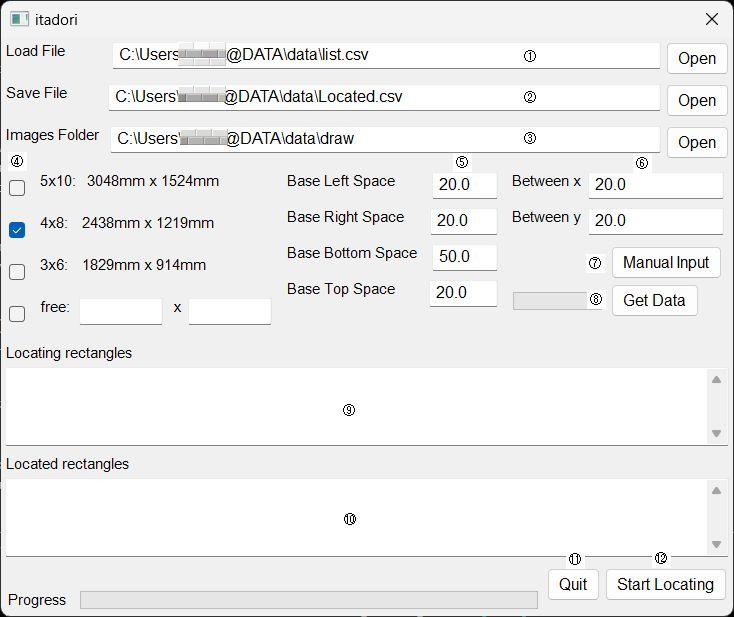
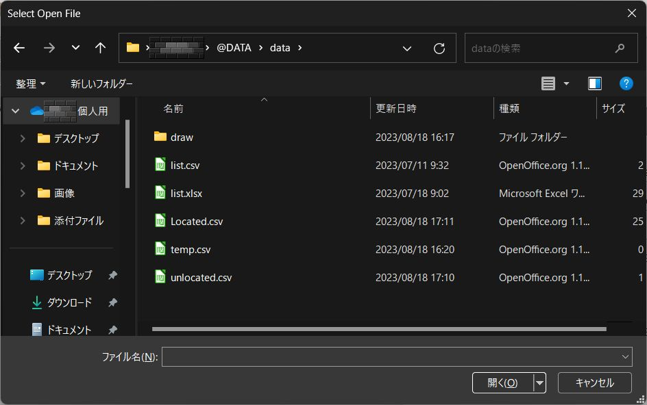
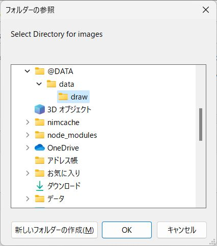
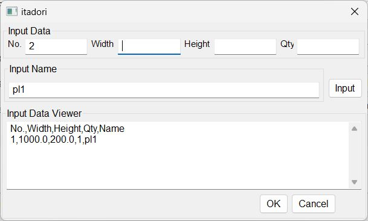

# 板取プログラム　CuttingStock (Locating Rectngles into a rectangle, "ITADORI")　

複数の長方形をひとつの長方形の中にできるだけ多くの長方形が並ぶように並べます。
ひとつの平板から多くの長方形を電動のこぎりやシャー等で切り出す際に歩留良く並べるためのプログラムです。
windowsの場合は、"itadori.exe"と"ini.json"をダウンロードし、同じフォルダーに保存してください。
"itadori.exe"を実行するとウィンドウが立ち上がります。必要な情報を入力し実行することで自動的に長方形を並べ、並べた図を出力します。
データフォルダーは自由に選べます。そのフォルダーの中に並べられた長方形のデータなどが保存されます。

drawフォルダー: 長方形の図がpng形式で保存されます

Located.csv: 並べられた長方形のデータ　（ファイル名変更可能）

unlocated.csv: 並べることのできなかった長方形のデータ

temp.csv: 手動入力の際保存される一時データ

Locate rectangles into a rectangle as guillotine cut.

## install
### Windiows
Use the two files. 
Save the files into same folder. 
Run "itadori.exe". 

  "itadori.exe"

  "ini.json"
  
You can get the two files in "src" folder.

### Mac, Linux, others
Download the all files. 
Install "Nim" in your PC. 
Compile "src/itadori.nim".  "nim c -r itadori.nim"

## Usage
### Run itadori.exe
When run itadori.exe, show mainwindow.

### Items in the window
① Path of input data file. you can use "csv" file or "Excel" file. The file has to contain the following data. When click "Open" button, show file select dialog. you can select file from the dialog.

DATA CONTENTS:

NO., Width(mm), Height(mm), Qty

② Path of output data file. You can select any folder and you can change the file neme. The output file is csv file. When click "Open" button, show file select dialog. you can select file from the dialog.

③ Path of image folder. You can select any folder. Draw folder will be made in the selected folder.  When click "Open" button, show file select dialog. you can select folder from the dialog.

④ Check box to select base rectangle size.

⑤ Outside trerance of base rectangle.

⑥ Space between located rectangles.

⑦ When you want to input data manually, click this button. Manual input dialog will apear.

⑧ Try input data. Click this button. When the input data is calculatable, show the data into ⑨

⑨ Input data viewer

⑩ Output data Viewer

⑪ Quit button. Leave main window without calculate.

⑫ Calculate button. get input data, calculate location of rectangles, make and save output data, make and save images.

